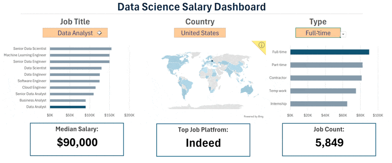

# 📊 Excel Salary Dashboard

## 📌 Introduction
This **Data Jobs Salary Dashboard** was created to help job seekers explore salary trends across data-related roles and ensure they are being fairly compensated.

The project is based on data from my 2023 Job Postings availavle in the **DATASETS Folder**, which focuses on building a strong foundation in data analysis using Excel. The dataset includes detailed information on job titles, salaries, locations, and required skills, all visualized in an interactive dashboard .

---

## 📁 Dashboard File
- **Final Dashboard:** `1_Salary_Dashboard.xlsx`

---

## 🧠 Excel Skills Used
The following Excel skills were utilized throughout the analysis:

- 📉 Charts & Data Visualization  
- 🧮 Formulas and Functions  
- ❎ Data Validation  

---

## 📊 Data Jobs Dataset
The dataset contains **real-world data science job information from 2023**, provided through my Excel course. It includes:

- 👨‍💼 Job Titles  
- 💰 Salaries  
- 📍 Locations  
- 🛠️ Skills  

---

## 🛠️ Dashboard Build

### 📉 Charts

#### 📊 Data Science Job Salaries – Bar Chart

- 🛠️ **Excel Features:** Bar chart with formatted salary values and optimized layout  
- 🎨 **Design Choice:** Horizontal bar chart for easy comparison  
- 📉 **Data Organization:** Job titles sorted by descending median salary  
- 💡 **Insights Gained:** Senior roles and Engineering positions typically earn more than Analyst roles  

---

#### 🗺️ Country Median Salaries – Map Chart

- 🛠️ **Excel Features:** Excel Map Chart to plot global median salaries  
- 🎨 **Design Choice:** Color-coded map to distinguish salary levels  
- 📊 **Data Representation:** Median salary by country  
- 👁️ **Visual Enhancement:** Immediate understanding of geographic salary trends  
- 💡 **Insights Gained:** Highlights global salary disparities and high/low-paying regions  

---

Conclusion
I created this dashboard to showcase insights into salary trends across various data-related job titles. Utilizing data from my Excel course, this dashboard allows users to make informed decisions about their career paths. Exploring the functionalities to understand how location and job type influence salaries.
